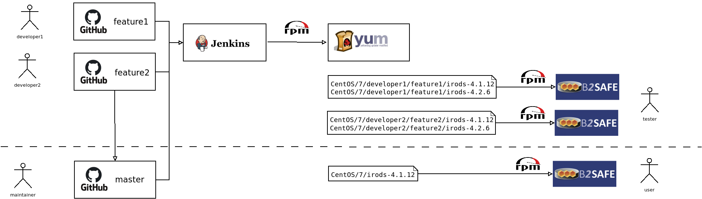

# Building the package locally



## Requirements

  * docker
  * docker-compose

## Building and testing

The script can be used *./ci/build.sh* to build the RPM package.

### Build the RPM

Build the B2SAFE package for CentOS 7 and iRODS 4.2.6.
```
./ci/build.sh centos7_4_2_6
```

If the build process was successful, the RPM will be copied to the shared target folder:

```
ls ci/RPMS/Centos/7/irods-4.2.6/
irods-eudat-b2safe-4.3.0-0.noarch.rpm
```

### Configure the functional test

In order to run the tests make sure that you have access to a handle server with a dedicated test prefix.
You should have received a private key and a certificate PEM file
(in this case *308_21.T12995_TRAINING_privkey.pem* and *308_21.T12995_TRAINING_certificate_only.pem*)

Configure the following files:

*ci/secret/epic2_credentials*:
```
{
    "handle_server_url": "https://epic5.storage.surfsara.nl:8003",
    "private_key": "/etc/irods/308_21.T12995_TRAINING_privkey.pem",
    "certificate_only": "/etc/irods/308_21.T12995_TRAINING_certificate_only.pem",
    "prefix": "21.T12995",
    "handleowner": "200:0.NA/21.T12995",
    "reverselookup_username": "21.T12995",
    "reverselookup_password": "<INSERT_PASSWORD_HERE>",
    "HTTPS_verify": "False"
}
```

*ci/secret/install.json*
```
{
  "server_id": "irods://{HOSTNAME}:1247",
  "server_api_reg": "irods://{UUID}:1247",
  "server_api_pub": "irods://{UUID}:1247",
  "handle_server_url": "https://epic5.storage.surfsara.nl:8003",
  "handle_private_key": "/etc/irods/308_21.T12995_TRAINING_privkey.pem",
  "handle_certificate_only": "/etc/irods/308_21.T12995_TRAINING_certificate_only.pem",
  "handle_prefix": "21.T12995",
  "handle_owner": "200:0.NA/21.T12995",
  "handle_reverse_lookup_name": "21.T12995",
  "handle_reverse_lookup_password": "<INSERT_PASSWORD_HERE>",
  "handle_https_verify": "False",
  "handle_users": [ "*" ],
  "handle_groups": []
}
```

### Run the functional test
```
./ci/test.sh centos7_4_2_6
```

### Automation

The details can be found in the Jenkinsfile in the root of the repository.


